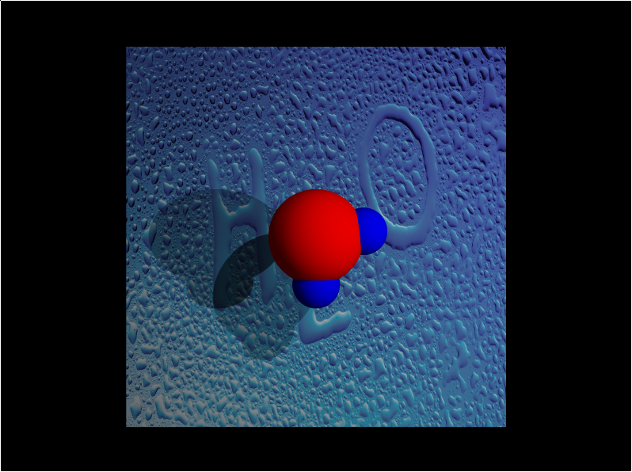
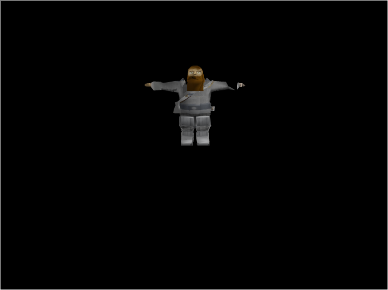
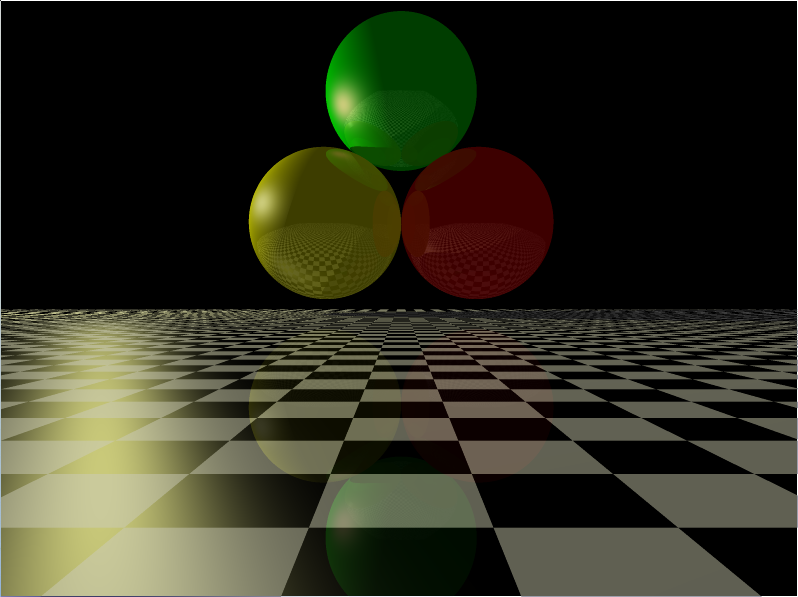
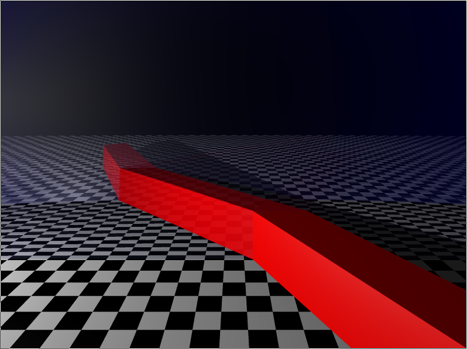
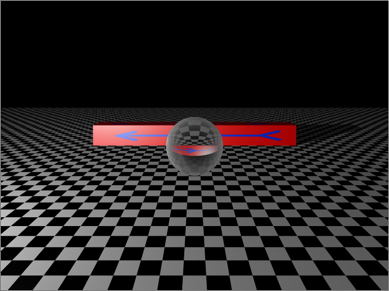
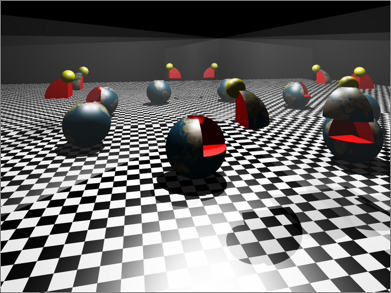

# Description
This is a toy implementation of a ray tracing rendering algorithm.

##### Supported features:
* Basic primitives like triangles, spheres and parallelepipeds.
* Loading objects from files with simplified .obj format.
* Object arithmetics. Intersections, subtractions, unions, and complements are supported.
* Texture mapping.
* Custom materials. Refraction and reflection could be simulated.
* Several point and ambient light sources. Shadows are processed correctly.
* KDTree for efficient ray intersection.
* Parallel rendering.

# How to run
SDL and OpenMP are required for building. After installing them run

    mkdir build && cd build
    cmake ../
    make
    
After that run <code> ./Renderer </code>

# Examples

